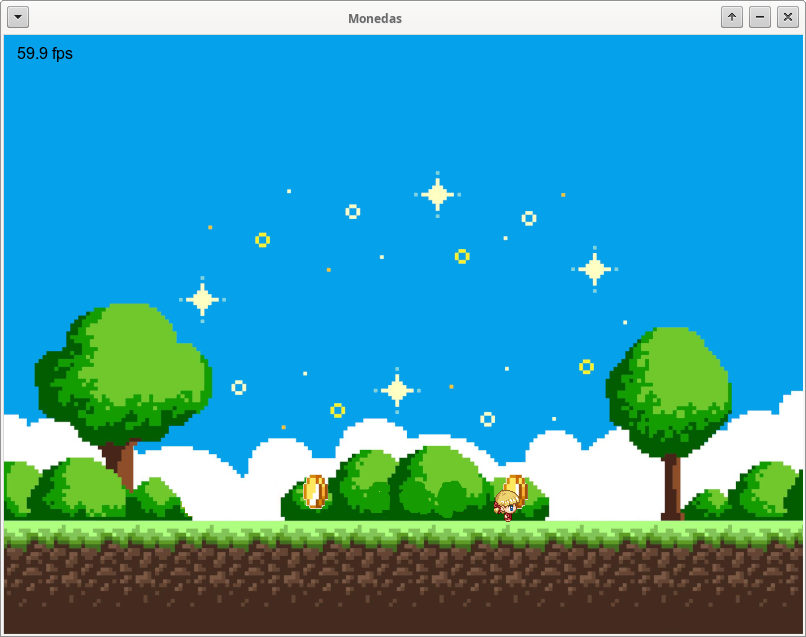

# MiniGameEngine
Mini motor de juegos escrito en python.

* Utiliza sólo tkinter y requierePython 3.6+
* La documentación se encuentra en doc/
* Algunos ejemplos se encuentran en ejemplos/

## Durante el desarrollo
* pip install -e .
* En VSCODE: File -> Preferences -> Settings: Buscar y Marcar "Python: Execute In File Dir"
* Verificación de código: ``$ pylint --module-naming-style PascalCase --method-naming-style camelCase src/MiniGameEngine/``
* Generación de documentación: ``$ pdoc -o doc --no-search --no-show-source -d google MiniGameEngine``
* Generación del WHL: ``$ python setup.py bdist_wheel``

